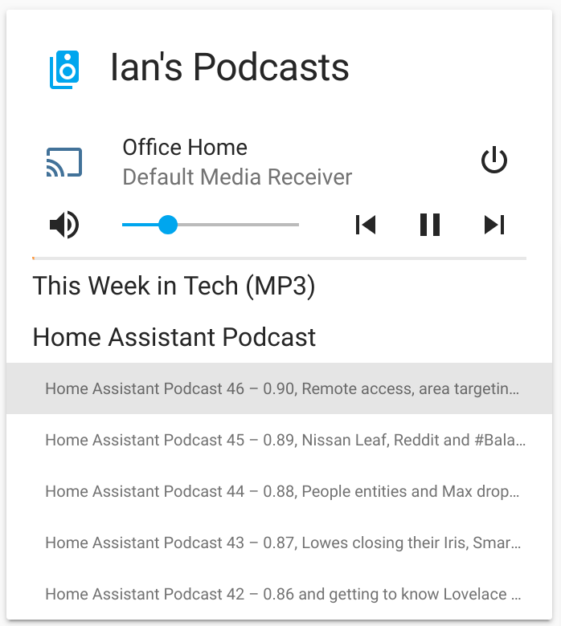

# Podcast Card
🎧 [gPodder](https://gpodder.net/) Podcast Card

[![GitHub Release][releases-shield]][releases]
[![GitHub Activity][commits-shield]][commits]
[![custom_updater][customupdaterbadge]][customupdater]
[![License][license-shield]](LICENSE.md)

![Project Maintenance][maintenance-shield]
[![BuyMeCoffee][buymecoffeebadge]][buymecoffee]

[![Discord][discord-shield]][discord]
[![Community Forum][forum-shield]][forum]

This card is for [Lovelace](https://www.home-assistant.io/lovelace) on [Home Assistant](https://www.home-assistant.io/) to display your podcast subscriptions and play them on your media players connected to Home Assistant



## Options

| Name | Type | Requirement | Description
| ---- | ---- | ------- | -----------
| type | string | **Required** | `custom:podcast-card`
| entity | string | **Required** | Podcast sensor entity e.g. [gPodder](https://github.com/custom-components/gpodder)
| name | string | **Optional** | Card name `Podcasts`
| icon | string | **Optional** | Target selection icon `mdi:speaker-multiple`
| default_target | string | **Optional** | Default target to select on first load
| show_player | boolean | **Optional** | Show media player controls? `True`
| custom_player | boolean | **Optional** | Use [mini-media-player](https://github.com/kalkih/mini-media-player)? `False` **Note: Requires installation of `mini-media-player`**

## Installation

### Step 1

Save [podcast-card](https://github.com/custom-cards/podcast-card/raw/master/dist/podcast-card.js) to `<config directory>/www/podcast-card.js` on your Home Assistant instanse.

**Example:**

```bash
wget https://raw.githubusercontent.com/custom-cards/podcast-card/master/dist/podcast-card.js
mv podcast-card.js /config/www/
```

### Step 2

Link `podcast-card` inside your `ui-lovelace.yaml` or Raw Editor in the UI Editor

```yaml
resources:
  - url: /local/podcast-card.js
    type: module
```

### Step 3

Add a custom element in your `ui-lovelace.yaml` or in the UI Editor as a Manual Card

```yaml
type: 'custom:podcast-card'
entity: sensor.gpodder
name: Ian's Podcasts
default_target: media_player.office_home
show_player: True
custom_player: True
```

[Troubleshooting](https://github.com/thomasloven/hass-config/wiki/Lovelace-Plugins)

[buymecoffee]: https://www.buymeacoffee.com/iantrich
[buymecoffeebadge]: https://img.shields.io/badge/buy%20me%20a%20coffee-donate-blue.svg?style=for-the-badge
[commits-shield]: https://img.shields.io/github/commit-activity/y/custom-cards/podcast-card.svg?style=for-the-badge
[commits]: https://github.com/custom-cards/podcast-card/commits/master
[customupdater]: https://github.com/custom-components/custom_updater
[customupdaterbadge]: https://img.shields.io/badge/custom__updater-true-success.svg?style=for-the-badge
[discord]: https://discord.gg/Qa5fW2R
[discord-shield]: https://img.shields.io/discord/330944238910963714.svg?style=for-the-badge
[forum-shield]: https://img.shields.io/badge/community-forum-brightgreen.svg?style=for-the-badge
[forum]: https://community.home-assistant.io
[license-shield]: https://img.shields.io/github/license/custom-cards/podcast-card.svg?style=for-the-badge
[maintenance-shield]: https://img.shields.io/badge/maintainer-Ian%20Richardson%20%40iantrich-blue.svg?style=for-the-badge
[releases-shield]: https://img.shields.io/github/release/custom-cards/podcast-card.svg?style=for-the-badge
[releases]: https://github.com/custom-cards/podcast-card/releases
